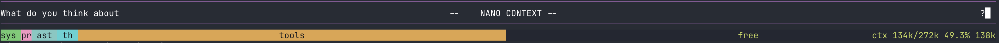
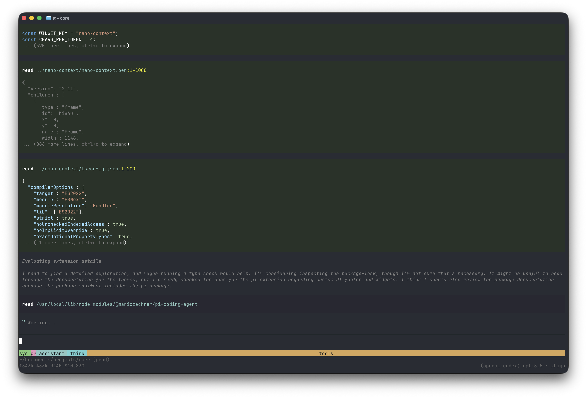

<div align="center">

# NANO CONTEXT

**A tiny `pi.dev` extension that replaces the default context meter with a compact segmented bar under the editor.**



</div>

## What it is

`nano-context` shows where your current session context is going. The bar sits right under the input, takes the full terminal width, and splits the model window into colored pieces: system prompt, your prompts, assistant output, thinking, tool results, and free space.

That's the whole thing. No sidebar, no popover, no second context meter in the footer.

## In action

A bigger session with tool output taking most of the window:

<p align="center">
  
</p>

## Segments

The labels shrink as the terminal gets tight, but the colors stay stable:

- `sys` — current system prompt
- `pr` — user prompts and attached images
- `assistant` — visible assistant text and tool-call JSON
- `think` — assistant thinking blocks, when pi has them
- `tools` — tool results
- `free` — unused model window, with the compact token total at the end

The segment sizes are proportional. If pi has provider-backed usage for the turn, `nano-context` scales the estimates to that real total so the whole bar matches pi's context count.

## Install

From npm:

```bash
pi install npm:nano-context
```

Or from GitHub:

```bash
pi install git:github.com/daynin/nano-context
```

That writes to your global pi settings (`~/.pi/agent/settings.json`). Pass `-l` to install only for the current project. Other install sources work too — local path, https URL — see the [pi packages docs](https://github.com/badlogic/pi-mono/blob/main/packages/coding-agent/docs/packages.md) for the full list.

Verify with `pi list`. Remove with `pi remove nano-context`.

## Testing

Typecheck it:

```bash
npm run typecheck
```

Smoke-load it:

```bash
pi --no-extensions -e ./index.ts --no-session --no-tools -p "Reply ok"
```

To see every used segment, run pi with tools enabled, ask it to read a file, then ask a second question in the same session. You should see prompt, assistant, tools, system, and free. The `think` segment appears only when the selected model/provider stores thinking blocks in the session.

## Stack

- TypeScript strict, no build step. The extension loads as `.ts` source via jiti.
- Deps: `@mariozechner/pi-coding-agent`. Nothing else.

## License

MIT.
